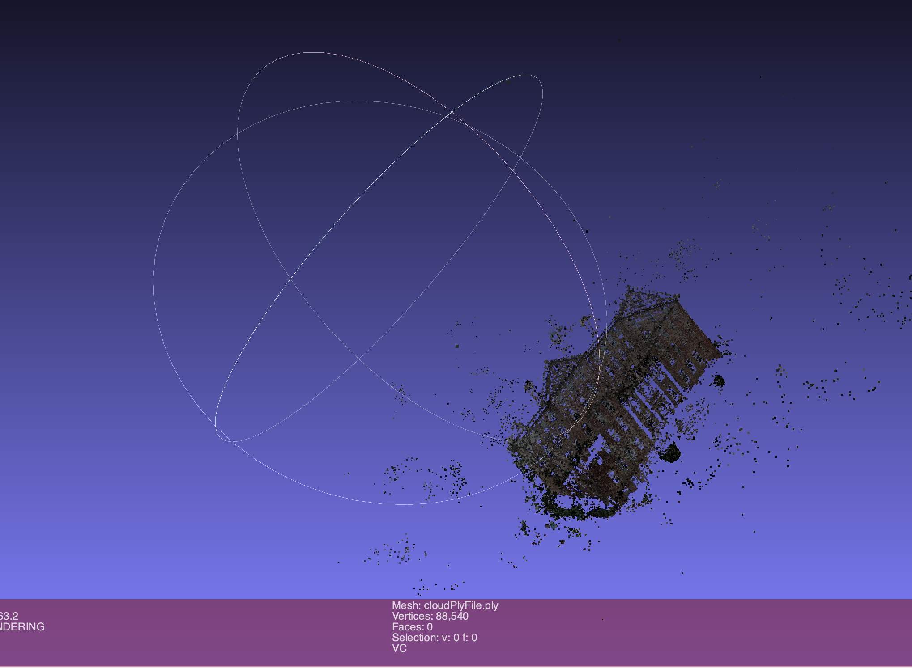
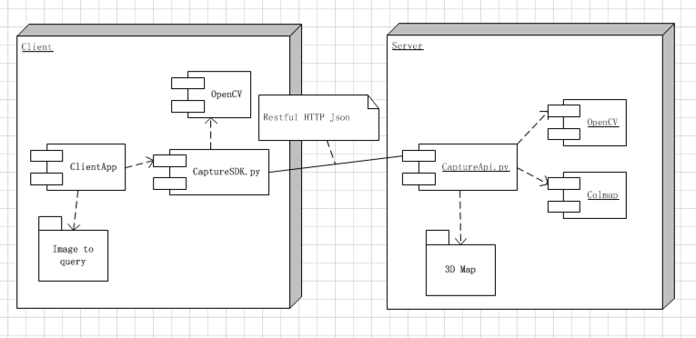

# 3d_mapping_localization_GPS

Requirements:

Create a folder for the workspace, it should be added in the .env file in the server directory.

mkdir colmap_workspace

modify the root_dir path in server.env

Create a conda environment:

conda create -n colmap python=3.6

conda activate colmap_test

Install the python packages:

pip install numpy flask flask_restful opencv-python scipy open3d environs flask_httpauth

# **About:**

Restfull 3D Map Service API
Using images to contribute 3D map

# **1. Upload all the images of map**

import CaptureSDK

CaptureSDK.ClearWorkspace(api_url, token, deleteAnchorImage, bank, username, password)

CaptureSDK.post_to_server(api_url, token, image_base_dir, seq_base, bank, username, password)

|Parameters:||
| ----- | --------- |
|api_url:| server url, like: http://localhost:5444/capture-photo|
|token: |standby field, for future permission verification|
|deleteAnchorImage: |standby field, whether to delete the anchor image|
|image_base_dir: |the client local director of images|
|seq_base: |image sequence number like: 0|
|bank: |workspace bank number like: 0|

# **2. Build 3D map according these images of map**

import CaptureSDK

CaptureSDK.StartMapConstruction(api_url, token, map_name, windowSize, feature_dim, bank, username, password)

|Parameters:||
| ----- | --------- |
|api_url: |server url, like: http://localhost:5444/capture-photo|
|token: |standby field, for future permission verification|
|map_name: |standby field, name of 3D map|
|windowSize: |standby field|
|feature_dim: |images feature contribute by colmap engine is 6; by CV is 2|
|bank: |workspace bank number like: 0|

# **3. Clear the workspace(clear all data and files related the map)**

import CaptureSDK
CaptureSDK.ClearWorkspace(api_url, token, deleteAnchorImage, bank, username, password)

|Parameters:||
| ----- | --------- |
|api_url: |server url, like: http://localhost:5444/capture-photo|
|token: |standby field, for future permission verification|
|deleteAnchorImage: |standby field, whether to delete the anchor image|

# **4. Upload one image to get coordinate of the map**

import CaptureSDK

CaptureSDK.QueryLocal(api_url, token, uploadImagePath, bank, username, password)

|Parameters:||
| ----- | --------- |
|api_url: |server url, like: http://localhost:5444/capture-photo|
|token: |standby field, for future permission verification|
|uploadImagePath: |the client image's full file path, like: /Users/akui/Desktop/south-building/images/P1180141.jpg|
|bank: |workspace bank number like: 0|

# **5. Upload the cv feature of a image to get coordinate of the map**

import CaptureSDK

CaptureSDK.CVQueryLocal(api_url, token, uploadImagePath, bank, username, password)

|Parameters:||
| ----- | --------- |
|api_url: |server url, like: http://localhost:5444/capture-photo|
|token: |standby field, for future permission verification|
|uploadImagePath: |the client image's full file path, like: /Users/akui/Desktop/south-building/images/P1180141.jpg|
|bank: |workspace bank number like: 0|

# **6. Query the whole 3D map cloud points**

CaptureSDK.Query3DCouldPoint(api_url, token, bank, username, password)

|Parameters:||
| ----- | --------- |
|api_url: |server url, like: http://localhost:5444/capture-photo|
|token: |standby field, for future permission verification|
|bank: |workspace bank number like: 0|

# **7. Writing the whole 3D map cloud points to file**

CaptureSDK.Write3dmap2PlyFile(db_points_pos, db_points_des, dp_points_rgb, ply_file_path)

| Parameters:    ||
|----------------|------------------------------ |
| db_points_pos  |position info of 3d map, get it by Query3DCouldPoint f 3d map, get it by Query3DCouldPoint |
| db_points_des: | des info of 3d map, get it by Query3DCouldPoint      |
| dp_points_rgb: | color info of 3d map, get it by Query3DCouldPoint    |
| ply_file_path: | the target file                                      |
